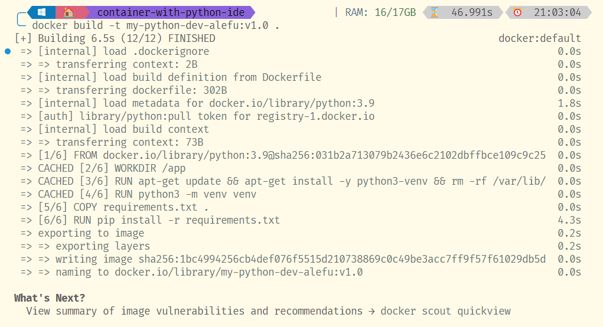

# Python | container remote with IDE


---

In this tutorial we go to use container docker with Python development that can use with Python Integrated Development Environment (IDE).

## Steps

## Step 1 | create a Dockerfile with Python image

The file `Dockerfile` has all step for create a imagen docker in our environment.

## Step 2 | list Python dependencies

When one instance of Python is created, can set some dependencies in one file called 'requeriment.txt' file.

## Step 3 | Building docker image

Building my Docker image from Dockerfile:

```bash
# use -t for define name and tag of my imagen 
docker build -t my-pythonm-dev-alefu:v1.0 .
```
## Step 4 | Run the docker container

Now I run my Docker container from the Docker image created.

> for see our local docker images, we can use next command: `docker image ls`.
> 
> ```bash
> docker image ls
>
>REPOSITORY                               TAG        IMAGE ID       CREATED         SIZE
>my-python-dev-alefu                      v1.0       1bc4994256cb   9 minutes ago   1.03GB
>```
>

### Run our container: 

```bash
# -it allows interactive mode
# --rm removes the container whe it stops
# -v <my-local-path>:</my-container-path> mounts the local path to container directory.
docker run -it --rm -p 4000:80 -v ./mypythonapp:/app my-pythonm-dev-alefu:v1.0 
```
<div style="display:flex; flex-direction: column; align-items: flex-start;align-content: center;margin:10px 0 10px 0;">

<small>docker image created.</small>
</div>

## Step 5 | Install one plugin and Use IDE:
Now open our Python IDE, in my case is VSCode.

Install one plugin [`Remote Development`][link-plugin] one microsoft plugin

<div style="display:flex; flex-direction: column; align-items: flex-start;align-content: center;margin:10px 0 10px 0;">

<small>install this plugin</small>
</div>

### Use plugin:

After install this plugin, we can use it with one click in the bottom left corner.

<div style="display:flex; flex-direction: column; align-items: flex-start;align-content: center;margin:10px 0 10px 0;">

<small>First, go to site, and after loged, select API menu</small>
</div>

Next, open box where we can select the `Attach to Running Container..`

<div style="display:flex; flex-direction: column; align-items: flex-start;align-content: center;margin:10px 0 10px 0;">

<small>First, go to site, and after loged, select API menu</small>
</div>

And next, select our container:

<div style="display:flex; flex-direction: column; align-items: flex-start;align-content: center;margin:10px 0 10px 0;">

<small>First, go to site, and after loged, select API menu</small>
</div>

### Use container how repository of our code

After attach our container, we can craeta our Python project, for studying and learn this great language.

<div style="display:flex; flex-direction: column; align-items: flex-start;align-content: center;margin:10px 0 10px 0;">

<small>First, go to site, and after loged, select API menu</small>
</div>

---

Thanks for reading it !!!


<!-- links and tools -->
[link-plugin]: https://marketplace.visualstudio.com/items?itemName=ms-vscode-remote.vscode-remote-extensionpack